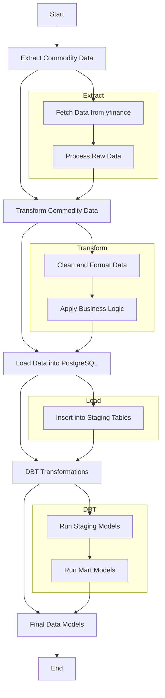

# Commodities ETL Pipeline and Data Warehouse

## Overview

This project implements an ETL (Extract, Transform, Load) pipeline for commodities data and sets up a Data Warehouse using dbt (data build tool). It extracts financial data from Yahoo Finance (yfinance), performs transformations, and loads the processed data into a PostgreSQL database for further analysis.



## Technologies used in different stages:

- Extract: Python with yfinance library
- Transform: Python with pandas for initial transformations, dbt for further modeling
- Load: SQLAlchemy to load data into PostgreSQL
- Database: PostgreSQL hosted on AWS RDS (Amazon Relational Database Service)
- Data Warehouse: dbt for transformations and modeling
- Query and Management: pgAdmin for database queries and management

## Features

- Data extraction from Yahoo Finance using the yfinance library
- Data transformation and modeling with dbt
- Pandas for intermediate data manipulation
- PostgreSQL as the data warehouse, hosted on AWS RDS
- Poetry for dependency management
- Environment variable management with python-dotenv

## Prerequisites

- Python 3.12+
- PostgreSQL
- dbt 1.8+
- Poetry (optional, but recommended)

## Installation

You have two options for setting up this project: using Poetry (recommended) or using pip.

### Option 1: Using Poetry (Recommended)

If you already have Poetry installed:

1. Clone this repository:

   ```
   git clone https://github.com/your-username/commodities-etl-pipeline.git
   cd commodities-etl-pipeline
   ```

2. Install dependencies using Poetry:

   ```
   poetry install
   ```

3. Activate the virtual environment:
   ```
   poetry shell
   ```

If you don't have Poetry installed, you can install it by following the instructions at [https://python-poetry.org/docs/#installation](https://python-poetry.org/docs/#installation)

### Option 2: Using pip

If you prefer not to use Poetry:

1. Clone this repository:

   ```
   git clone https://github.com/your-username/commodities-etl-pipeline.git
   cd commodities-etl-pipeline
   ```

2. Create a virtual environment:

   ```
   python -m venv venv
   ```

3. Activate the virtual environment:

   - On Windows:
     ```
     venv\Scripts\activate
     ```
   - On macOS and Linux:
     ```
     source venv/bin/activate
     ```

4. Install dependencies using pip:
   ```
   pip install -r requirements.txt
   ```

After installation, proceed with the setup of dbt:

5. Set up dbt:
   ```
   dbt init
   ```
   Follow the prompts to configure your dbt project.

Note: This project requires Python 3.12 or higher.

## Configuration

1. Create a `.env` file in the project root and add your database credentials:

   ```
   DB_HOST_PROD=your_host
   DB_PORT_PROD=your_port
   DB_NAME_PROD=your_database_name
   DB_USER_PROD=your_username
   DB_PASSWORD_PROD=your_password
   DB_SCHEMA_PROD=your_schema
   DB_THREADS_PROD=number_of_threads
   DB_TYPE_PROD=your_database_type
   ```

   Replace the placeholders with your actual database information. Ensure to keep your `.env` file secure and never commit it to version control.

2. Update the `profiles.yml` file in your dbt configuration directory (usually `~/.dbt/`) with your database connection details.

## Usage

1. Run the data extraction and initial load script:

   ```
   python scripts/extract_load_data.py
   ```

2. Run dbt models:

   ```
   dbt run
   ```

3. Test dbt models:
   ```
   dbt test
   ```

## Project Structure

```
commodities-etl-pipeline/
├── dbt_project.yml
├── models/
│   ├── staging/
│   │   ├── stg_commodities.sql
│   │   ├── stg_commodities_transactions.sql
│   │   └── schema.yml
│   └── mart/
│       ├── dm_commodities.sql
│       └── schema.yml
├── scripts/
│   └── extract_load_data.py
├── tests/
├── seeds/
│   └── commodities_transactions.csv
├── macros/
├── analyses/
├── .env
├── README.md
└── requirements.txt
```

## Data Models

- **Staging Models**:
  - `stg_commodities`: Processes raw commodity data
  - `stg_commodities_transactions`: Processes transaction data
- **Mart Models**:
  - `dm_commodities`: Integrates commodity and transaction data for analysis
