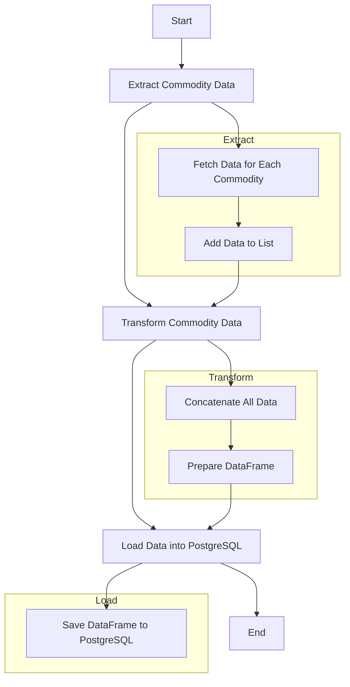



### DBT-Core Project README

# DBT-Core Project for Commodities Data Warehouse

This project uses DBT to manage and transform data for a Commodities Data Warehouse (DW). The goal is to create a robust and efficient data pipeline that processes and organizes commodity data and their transactions for analysis.

## Project Structure



### 1. Models

Models define data transformations using SQL. They are divided into two main layers: staging and datamart.

#### Staging

The staging layer is responsible for preparing and cleaning the data before it's loaded into the final analysis tables.

- **stg_commodities.sql**: Processes and formats commodity data.
- **stg_commodities_transactions.sql**: Processes and formats data on commodity transactions.

#### Datamart

The datamart layer is where the final analysis data is stored. It's based on the data prepared by the staging layer.

- **dm_commodities.sql**: Integrates the processed commodity and transaction data, creating a final data model for analysis.

### 2. Seeds

Seeds are static CSV files that are loaded directly into the database. They are useful for loading reference data or small datasets that don't change frequently.

- **commodities_transactions.csv**: Contains data about commodity transactions.

## Directory Structure

```plaintext
dw_commodities/
├── models/
│   ├── staging/
│   │   ├── stg_commodities.sql
│   │   ├── stg_commodities_transactions.sql
│   │   └── schema.yml
│   └── datamart/
│       ├── dm_commodities.sql
│       └── schema.yml
├── seeds/
│   └── commodities_transactions.csv
├── dbt_project.yml
├── profiles.yml
└── .env
```

## Running the Project

### Requirements

- Python 3.12
- DBT
- PostgreSQL

### Execution Steps

1. **Clone the Repository**:

   ```bash
   git clone https://github.com/R-midolli/ETL_Commodities.git
   cd ETL_Commodities
   ```

2. **Install Dependencies**:

   ```bash
   poetry install
   ```

3. **Configure DBT**:
   Ensure your `profiles.yml` file is correctly set up in the `~/.dbt/` directory or as specified by `DBT_PROFILES_DIR`.

4. **Run DBT Commands**:
   ```bash
   dbt run
   dbt test
   ```

## Configuration Files

### dbt_project.yml

```yaml
name: "dw_commodities"
version: "1.0.0"
profile: "dbcommodities"
# ... (other configurations)
```

### profiles.yml

```yaml
dbcommodities:
  outputs:
    dev:
      type: postgres
      host: dpg-cs7bs1ij1k6c73feffq0-a.oregon-postgres.render.com
      port: 5432
      user: postgres94
      pass: 0vUIM8x4oM3hQpI0RY7zynX9YikF7bpF
      dbname: dbcommodities
      schema: public
      threads: 1
  target: dev
```

## Model Descriptions

### stg_commodities.sql

This model processes and formats commodity data, including date, closing price, and ticker symbol.

### stg_commodities_transactions.sql

This model processes and formats data on commodity transactions, including date, ticker, transaction type, and quantity.

### dm_commodities.sql

This model integrates the processed commodity and transaction data, creating a final data model for analysis. It includes calculations for transaction value and profit/loss.

## Environment Variables

Environment variables are stored in the `.env` file and include database connection details.


